# Proyecto de Aprendizaje Automático
## Segmentación de Siniestros Viales mediante K-Means

**Alumna:** Rojas, Paola

---

## 1. Descripción del Dataset

El conjunto de datos bajo análisis recopila los registros de siniestralidad vial ocurridos en la red de autopistas urbanas administradas en la jurisdicción correspondiente durante el año 2024. Cuenta con un formato tabular estructurado en el cual cada instancia (fila) representa un siniestro vial único e individual reportado y atendido por los servicios viales.

El archivo cubre de manera continua la totalidad de los eventos reportados desde el 1 de enero de 2024 hasta finales de diciembre de 2024.

### Características del Dataset

El dataset contiene **844 registros** y está compuesto por **14 columnas (características)** que combinan datos de posicionamiento geográfico, factores climáticos del entorno, tipología del accidente y el conteo de actores viales e involucrados. A continuación se detallan sus componentes y tipos de datos:

1. **FECHA** (Tipo de dato: Temporal / Texto): Indica el día, mes y año en el que ocurrió el incidente (Formato: DD/MM/AAAA).

2. **HORA** (Tipo de dato: Numérico Entero - int): Registra la hora exacta en formato de 24 horas (valores de 0 a 23) en la que se notificó el evento.

3. **AUTOPISTA** (Tipo de dato: Categórico / Texto): Identifica la traza vial principal donde se localiza el hecho (ej. AU 25 DE MAYO, AV. LUGONES, AU DELLEPIANE, AU FRONDIZI, AU ILLIA, PASEO DEL BAJO)

4. **BANDA y/o RAMAL** (Tipo de dato: Categórico / Texto): Especifica el sentido de circulación (ASCENDENTE o DESCENDENTE) o si el evento ocurrió en una zona de transferencia conectora (RAMAL DE ENLACE, DISTRIBUIDOR)

5. **PK** (Tipo de dato: Alfanumérico / Continuo tratado como texto): Corresponde al Punto Kilométrico o la altura métrica exacta sobre la autopista donde se situó la colisión. Presenta algunos valores nulos o no disponibles denotados con un guion (-) cuando ocurrió en ramales de enlace complejos.

6. **CONDICIONES METEOROLÓGICAS** (Tipo de dato: Categórico / Texto): Describe el estado del tiempo al momento del choque (Valores principales: BUENO, LLUVIOSO)

7. **SUPERFICIE DE LA VIA** (Tipo de dato: Categórico / Texto): Describe el estado físico de la calzada (Valores principales: SECA, MOJADA/HUMEDA). Esta variable presenta una alta correlación lógica con las condiciones meteorológicas.

8. **LESIONADOS** (Tipo de dato: Numérico Entero - int): Variable de severidad que contabiliza la cantidad de personas que requirieron asistencia médica hospitalaria inmediata a causa del accidente (valores >= 0).

9. **FALLECIDOS** (Tipo de dato: Numérico Entero - int): Variable crítica de severidad extrema que registra el conteo de víctimas fatales en el lugar del hecho o derivadas de este.

10. **TIPO DE SINIESTRO** (Tipo de dato: Categórico / Texto): Clasificación del accidente según su mecánica de impacto. (Ejemplos en los datos: COLISIÓN CON DOS O MÁS VEHÍCULOS, COLISIÓN CON OBSTÁCULO FIJO, SINIESTRO DE UN SOLO VEHÍCULO / SIN COLISIÓN, OBSTÁCULO NO FIJO)

11. **MOTO** (Tipo de dato: Numérico Entero - int): Cantidad de motovehículos involucrados en la colisión.

12. **LIVIANO** (Tipo de dato: Numérico Entero - int): Cantidad de vehículos particulares o utilitarios livianos involucrados.

13. **BUS** (Tipo de dato: Numérico Entero - int): Cantidad de unidades de transporte público o colectivos involucrados.

14. **CAMIÓN** (Tipo de dato: Numérico Entero - int): Cantidad de vehículos de transporte de carga pesada involucrados.

---

## 2. Origen del Dataset

Los datos provienen del registro oficial de incidentes de las Autopistas Urbanas de la Ciudad de Buenos Aires (AUSA / Ministerio de Transporte), quienes centralizan las llamadas de emergencia, los reportes de las cámaras de seguridad vial, la asistencia de grúas y los partes policiales de siniestros ocurridos en las trazas viales rápidas y peajes bajo su concesión.

Los datos fueron recopilados de manera continua a lo largo del año 2024. La adquisición del archivo se realizó de manera consolidada una vez cerrado el periodo anual para asegurar que las causas y el conteo definitivo de lesionados y fallecidos estuvieran debidamente validados por las autoridades viales.

**Fuente del dataset:** https://data.buenosaires.gob.ar/dataset/seguridad-vial-autopistas-ausa

---

## 3. Preprocesamiento de los Datos

### Exploración inicial

Para conocer la estructura de los datos se utilizaron las funciones:

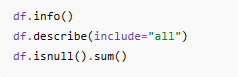

Antes de aplicar cualquier algoritmo de aprendizaje automático es necesario comprender la estructura del dataset, identificar tipos de datos, verificar la existencia de valores faltantes y obtener estadísticas descriptivas básicas.

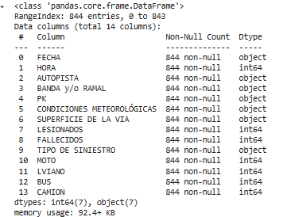

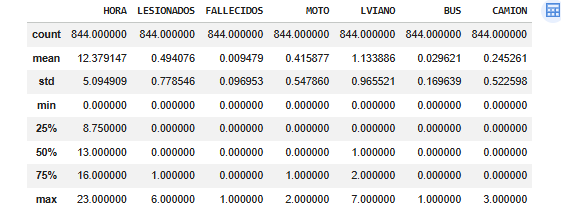

El dataset contiene tanto variables numéricas como variables categóricas.

No se encontraron problemas importantes en los datos, como errores o una gran cantidad de valores faltantes.

En varias variables categóricas se observa que algunas categorías aparecen con mucha más frecuencia que otras.

La mayoría de los siniestros registran pocos lesionados y fallecidos, por lo que estos valores suelen ser bajos en gran parte de los casos.

### Matriz de Correlación

Se analizó la correlación entre las variables numéricas mediante un mapa de calor.

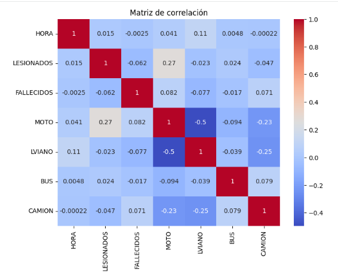

La matriz de correlación permite identificar relaciones entre variables numéricas y detectar posibles asociaciones que podrían influir en la formación de los clusters.

Esta matriz refuerza la decisión de utilizar K-Means. Como la mayoría de las variables tienen correlaciones bajas (colores claros), significa que los datos no siguen "reglas simples" o líneas rectas fáciles de predecir. El algoritmo de clustering es ideal aquí porque puede encontrar grupos complejos de accidentes basados en múltiples factores que no son evidentes a simple vista.

### Análisis exploratorio (EDA)

#### *Siniestros por autopista*

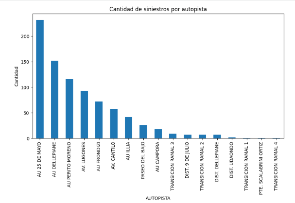

Se analizó la distribución de los siniestros según la autopista para identificar cuáles concentran la mayor cantidad de eventos.

Observamos que una minoría de trazas viales (como AU 25 de Mayo, AU Dellepiane y AU Perito Moreno) acumulan la gran mayoría de los siniestros.

El riesgo vial en la ciudad no es uniforme. La alta siniestralidad en la AU 25 de Mayo, comparada con ramales menores, sugiere que el volumen de tránsito y la densidad vehicular en las arterias principales son los factores que más disparan la frecuencia de incidentes.

#### *Distribución por Tipo de Siniestro*

El objetivo fue conocer cuáles son los tipos de accidentes más frecuentes dentro del conjunto de datos.

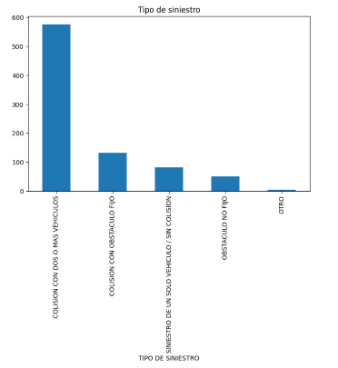

Las colisiones entre vehículos representan la categoría predominante.

Existen otros tipos de eventos menos frecuentes que podrían formar grupos específicos dentro del clustering.

#### *Condiciones Meteorológicas*

Se analizó la frecuencia de accidentes según las condiciones climáticas registradas.

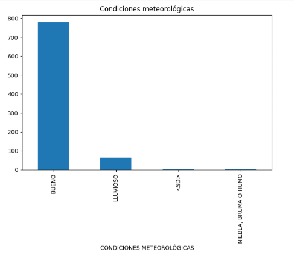

La inmensa mayoría de los siniestros (más de 750 casos) ocurren bajo condiciones meteorológicas de tipo "BUENO". Esto nos indica que el clima no es el factor determinante principal para que ocurra un accidente en estas autopistas. Si la gran mayoría de los accidentes ocurren cuando el clima es bueno, significa que el riesgo es intrínseco al flujo de tráfico, la infraestructura o el comportamiento humano, no a eventos meteorológicos extremos.

#### *Distribución Horaria de los Siniestros*

El horario es una variable importante porque puede reflejar patrones asociados al tránsito y a la circulación vehicular.

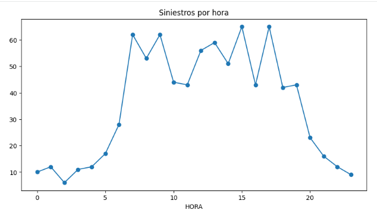

Observamos dos picos claros de siniestralidad, uno cerca de las 07:00 - 09:00 AM (hora pico de ingreso laboral/escolar) y otro cerca de las 15:00 - 17:00 PM (salida laboral).

En conjunto, el análisis exploratorio permitió identificar tendencias relevantes relacionadas con la ubicación, el horario y las características de los siniestros. Estos hallazgos justifican la aplicación de técnicas de clustering para descubrir perfiles de accidentes con comportamientos similares.

---

## Desarrollo del Modelo de Aprendizaje Automático

### Métricas de Evaluación

Debido a que el proyecto corresponde a un problema de Aprendizaje No Supervisado, no existen etiquetas reales contra las cuales comparar las predicciones del modelo. Por este motivo, métricas de clasificación como Accuracy, Precision, Recall o F1-Score no son aplicables.

En su lugar, se utilizaron métricas específicas para clustering:

- **Método del Codo (Inercia):** permitió analizar la compactación de los grupos y seleccionar una cantidad adecuada de clusters.

- **Silhouette Score:** permitió evaluar la cohesión interna de los clusters y la separación entre ellos.

Estas métricas son las más apropiadas para evaluar el desempeño de modelos de agrupamiento como K-Means.

### Preparación de los Datos

#### Codificación de Variables Categóricas

Para poder aplicar algoritmos matemáticos fue necesario transformar las variables categóricas en valores numéricos mediante **LabelEncoder**.

Variables transformadas:

- AUTOPISTA
- BANDA y/o RAMAL
- CONDICIONES METEOROLÓGICAS
- SUPERFICIE DE LA VÍA
- TIPO DE SINIESTRO

Transformamos estas variables ya que K-Means trabaja únicamente con datos numéricos y no puede procesar texto directamente.

#### Escalado de Variables

Se aplicó **StandardScaler** antes de utilizar PCA y K-Means.

Las variables poseen escalas muy diferentes. Por ejemplo:

- HORA varía entre 0 y 23.
- LESIONADOS suele tomar valores pequeños.
- Los códigos de las variables categóricas poseen rangos distintos.

El escalado evita que una variable tenga más influencia que otra en el cálculo de distancias.

### Reducción de Dimensionalidad mediante PCA

#### Aplicación de PCA

Antes de aplicar K-Means se utilizó **PCA (Principal Component Analysis)** para reducir la cantidad de dimensiones del conjunto de datos.

**¿Por qué se utilizó PCA?**

El dataset contiene varias variables que describen los siniestros viales. Trabajar con muchas dimensiones puede dificultar la visualización de los datos y aumentar la complejidad del análisis.

Por este motivo se aplicó PCA para transformar las variables originales en dos componentes principales que concentran la mayor cantidad posible de información.

Se seleccionaron dos componentes principales con el objetivo de reducir la dimensionalidad de los datos conservando la mayor cantidad posible de información. Estos componentes permitieron representar visualmente los registros en un plano bidimensional y fueron utilizados posteriormente para entrenar el algoritmo K-Means.

Además, la reducción de dimensionalidad facilitó la interpretación gráfica de los clusters obtenidos.

#### Visualización de los Componentes Principales

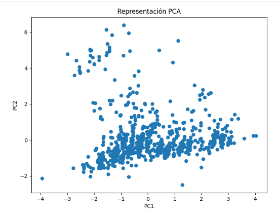

Cada punto representa un siniestro vial.

Los ejes PC1 y PC2 corresponden a los dos componentes principales generados por PCA. Se observa que los registros se encuentran distribuidos en distintas zonas del espacio, lo que sugiere la posible existencia de agrupamientos naturales dentro de los datos.

Esta representación facilita posteriormente la aplicación del algoritmo K-Means.

### Determinación del Número Óptimo de Clusters

#### Método del Codo

Para determinar la cantidad adecuada de grupos se aplicó el Método del Codo.

El Método del Codo permite analizar cómo disminuye la inercia a medida que aumenta el número de grupos.

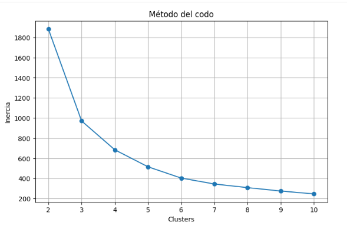

**Método del Codo:** Observamos que la inercia disminuye rápidamente hasta el valor de k=4, donde comienza a suavizarse la curva. Este "codo" es el punto óptimo donde el modelo logra una buena compactación de los grupos sin aumentar innecesariamente la complejidad.

#### Silhouette Score

Además del Método del Codo se utilizó el índice Silhouette.

El Silhouette Score mide qué tan bien separados están los grupos generados.

Valores más altos indican clusters mejor definidos.

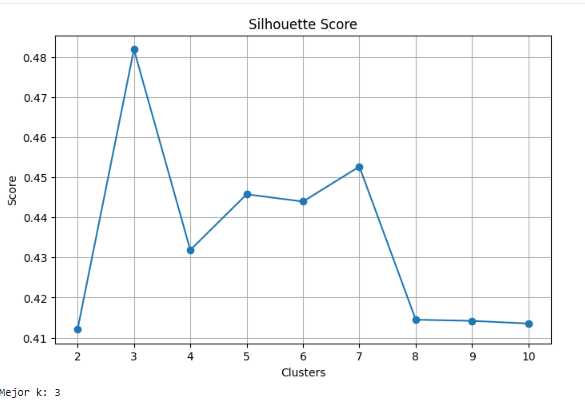

```
Mejor k: 3
```

Aunque la métrica de Silhouette sugiere 3 como mejor, al combinarla con el Método del Codo y realizar un análisis de los perfiles resultantes, encontramos que 4 grupos ofrecen una segmentación mucho más rica y detallada para entender los siniestros viales.

### Entrenamiento Final de K-Means

#### Aplicación del Modelo

Una vez determinado el valor óptimo de k, se entrenó el algoritmo K-Means utilizando los datos transformados mediante PCA.

**Parámetros utilizados:**

```python
n_clusters = 4
random_state = 42
n_init = 10
```

- **n_clusters:** corresponde al número de grupos seleccionado.
- **random_state:** garantiza la reproducibilidad de los resultados.
- **n_init=10** permite ejecutar el algoritmo varias veces y elegir la mejor solución encontrada.

#### Visualización de los Clusters

Cada color representa un cluster diferente identificado por el algoritmo.

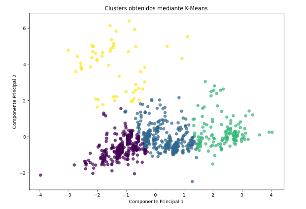

El gráfico muestra que el programa pudo separar los accidentes en cuatro colores distintos (morado, azul, verde y amarillo). Esto significa que el algoritmo no agrupó los datos al azar, sino que encontró diferencias reales entre ellos.

Los grupos de color morado y azul tienen muchísimos puntos juntos. Esto nos dice que la gran mayoría de los accidentes viales tienen características muy similares entre sí y ocurren bajo condiciones parecidas.

El grupo de color amarillo es el más curioso, porque está bien separado de los demás y más disperso. Esto indica que esos accidentes son "diferentes" al promedio; tienen algo particular (quizás una combinación rara de hora, tipo de vehículo o clima) que los hace únicos frente a los otros tres grupos.

Al ver estos cuatro colores tan bien marcados, confirmamos que elegir k=4 fue una buena decisión. Nos permite clasificar los accidentes de forma detallada, lo cual es mucho más útil que ver todo como una gran masa de datos sin sentido.

#### Visualización de Centroides

Los centroides representan el punto central de cada cluster.

Son utilizados por K-Means para asignar cada observación al grupo más cercano.

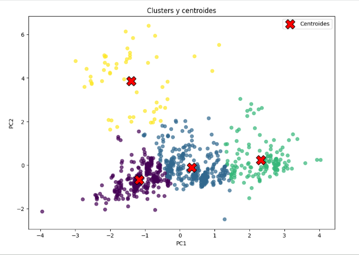

Los centroides permiten observar la ubicación promedio de cada grupo y ayudan a comprender cómo se distribuyen los clusters.

#### Tamaño de los Clusters

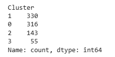

Los clusters 0 y 1 concentran la mayor parte de los siniestros.

El cluster 2 representa un grupo más específico de eventos.

El cluster 3 es el más pequeño, por lo que podría representar situaciones menos frecuentes o más particulares.

#### Centroides en variables originales

Se transformaron nuevamente los centroides a la escala original para facilitar su interpretación.

Esta tabla permite identificar el perfil promedio de cada cluster considerando las variables originales.

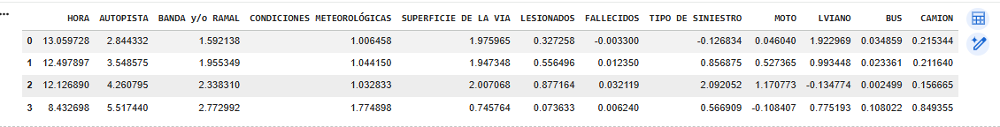

**Cluster 0 "Siniestros de vehículos livianos":** Aquí vemos un valor alto en LIVIANO (1.92) y valores muy bajos en el resto.
*Conclusión:* Representa el siniestro típico entre autos particulares, donde la cantidad de lesionados es moderada (0.32) en comparación con los perfiles de motos.

**Cluster 1 "Siniestros mixtos de baja severidad":** presenta una combinación moderada de motocicletas y vehículos livianos, sin niveles elevados de lesionados o fallecidos. Representa siniestros frecuentes de características intermedias entre los accidentes de autos particulares y los eventos con motocicletas.

**Cluster 2 "Siniestros de alta vulnerabilidad":** Observamos que en la columna MOTO tiene un valor alto (2.09) y en LESIONADOS también tiene el valor más alto (0.87).
*Conclusión:* Este grupo representa los siniestros que involucran motocicletas y que, por su naturaleza, resultan en una mayor cantidad de personas lesionadas. Es el perfil de mayor vulnerabilidad.

**Cluster 3 "Siniestros de transporte pesado":** La columna CAMION, tiene el valor más alto de toda la tabla (0.84), mientras que en MOTO tiene un valor negativo o bajo (-0.10).
*Conclusión:* Este grupo identifica incidentes donde el transporte de carga es el protagonista, diferenciándose claramente de los siniestros urbanos comunes.

#### Gráfico comparativo de clusters

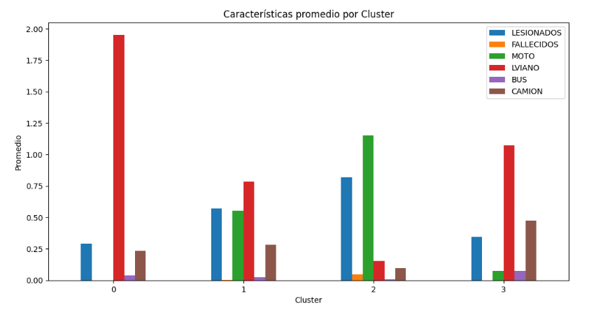

El gráfico permite comparar fácilmente las diferencias entre los grupos encontrados y detectar patrones de siniestralidad asociados a distintos tipos de vehículos y niveles de gravedad.

**Cluster 0 (Siniestros de vehículos livianos):** Se destaca por tener la barra roja más alta de todo el gráfico (LIVIANO), indicando que este grupo representa choques entre autos particulares donde la participación de otros vehículos es mínima.

**Cluster 1 (Siniestros mixtos):** Presenta barras altas tanto en autos (LIVIANO) como en motos (MOTO), reflejando un perfil de siniestros urbanos comunes donde conviven diferentes tipos de vehículos.

**Cluster 2 (Siniestros de alta vulnerabilidad):** Es el más crítico. Tiene la barra azul más alta (LESIONADOS) y la barra verde más alta (MOTO), lo que demuestra que los accidentes con motocicletas son los que dejan más personas heridas.

**Cluster 3 (Siniestros de transporte pesado):** Se identifica fácilmente porque es el único grupo con una barra marrón (CAMIÓN) significativamente alta, lo que muestra que este cluster agrupa los incidentes donde el transporte pesado es el protagonista.

#### Fronteras aproximadas de Decisión

Permite visualizar cómo K-Means divide el espacio en regiones y asigna cada observación al cluster más cercano.

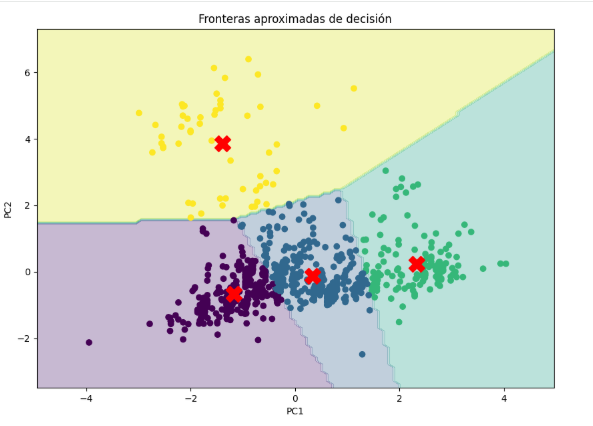

---

## Desarrollo y Evaluación del Modelo

Para la segmentación de siniestros se implementó el algoritmo K-Means mediante la librería scikit-learn. Se optó por este enfoque de aprendizaje no supervisado debido a la ausencia de etiquetas previas, con el propósito de identificar patrones y agrupamientos naturales dentro de los datos.

El modelo fue evaluado mediante métricas específicas para clustering: Inercia (Método del Codo) y Silhouette Score. En primer lugar, la Inercia (Método del Codo) permitió determinar que k=4 representa un punto adecuado de equilibrio, logrando una importante reducción de la dispersión dentro de los grupos. En segundo lugar, el Silhouette Score mostró que, si bien existen configuraciones más simples como k=3, la solución con k=4 mantiene una cohesión aceptable y ofrece una segmentación más detallada, diferenciando perfiles asociados a motocicletas, vehículos livianos y transporte pesado.

Los resultados obtenidos evidencian una adecuada capacidad del modelo para identificar grupos con características diferenciadas. Su principal fortaleza radica en la facilidad para interpretar los perfiles encontrados, transformando grandes volúmenes de datos en información útil para el análisis de la seguridad vial.

En relación con los objetivos planteados al inicio del proyecto, se logró identificar grupos de siniestros con características similares mediante técnicas de clustering. El análisis permitió descubrir patrones vinculados al tipo de vehículo involucrado y al nivel de gravedad de los accidentes, generando perfiles diferenciados de siniestralidad. De esta manera, se alcanzó el propósito de encontrar agrupamientos naturales dentro de los datos y obtener una mejor comprensión del comportamiento de los siniestros viales en las autopistas analizadas.

---

## Conclusiones y Líneas Futuras

### Conclusiones

El modelo permitió identificar cuatro perfiles de riesgo vial con características claramente diferenciadas. Los resultados obtenidos muestran que la siniestralidad en las autopistas no ocurre de manera aleatoria, sino que presenta patrones asociados al tipo de vehículo involucrado y al nivel de gravedad de los accidentes. En particular, el Cluster 2, caracterizado por una alta participación de motocicletas, concentra los mayores niveles de lesionados y fallecidos, constituyendo el perfil de mayor vulnerabilidad.

En términos generales, el proyecto permitió demostrar que las técnicas de aprendizaje no supervisado pueden utilizarse eficazmente para analizar la siniestralidad vial. A través del algoritmo K-Means fue posible identificar perfiles diferenciados de accidentes y descubrir patrones que no eran evidentes mediante un análisis tradicional. Estos resultados pueden servir como apoyo para la planificación de estrategias de prevención, gestión del tránsito y seguridad vial en las autopistas urbanas.

En conclusión, el uso de técnicas de aprendizaje no supervisado permitió transformar un gran volumen de datos de siniestralidad vial en información útil para la toma de decisiones. A través de K-Means se identificaron cuatro perfiles diferenciados de accidentes, aportando evidencia que puede contribuir al diseño de políticas de prevención y mejora de la seguridad vial.

### Limitaciones

El modelo no contó con información adicional relacionada con velocidad de circulación, características específicas de la infraestructura vial o factores humanos, los cuales podrían influir significativamente en la ocurrencia y gravedad de los siniestros.

### Líneas futuras

**Integración de datos temporales:** Incorporar análisis de series de tiempo para predecir siniestralidad según pronósticos meteorológicos avanzados.

**Incorporación de nuevas variables:** incluir información sobre velocidad, flujo vehicular, infraestructura vial y condiciones de tránsito para enriquecer el análisis.

**Modelado Predictivo:** Utilizar los clusters obtenidos como etiquetas para entrenar un modelo de clasificación supervisado (como un Random Forest) que permita predecir, ante un reporte de choque, qué tipo de perfil de gravedad enfrentarán los servicios de emergencia antes de llegar al lugar.
