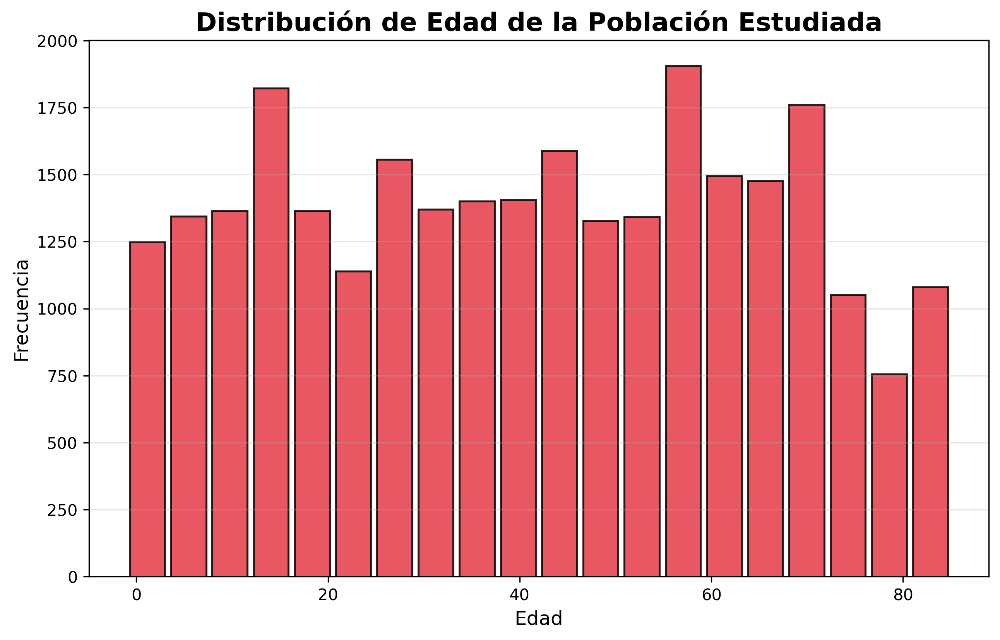
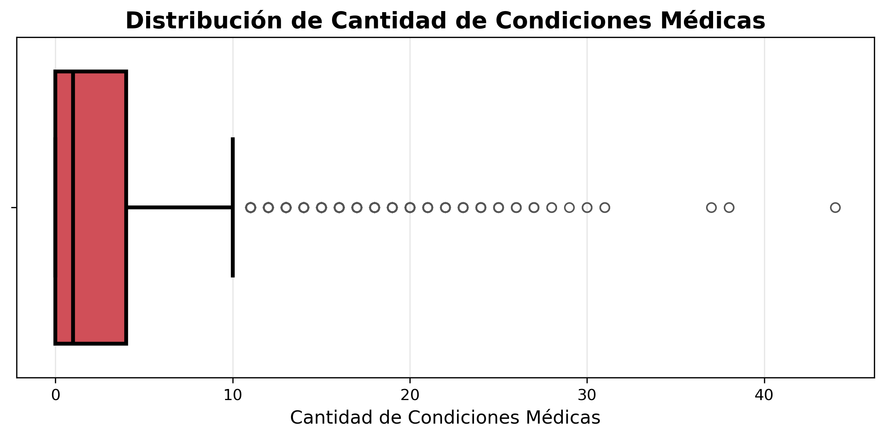
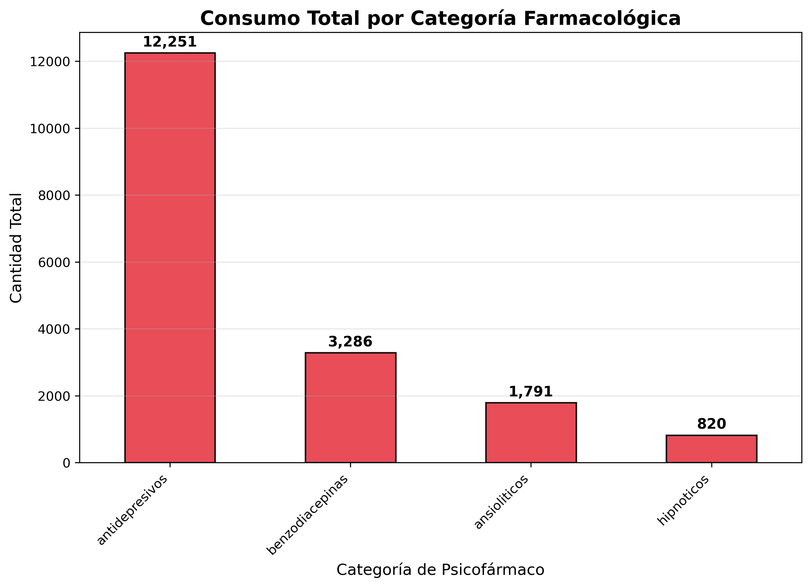
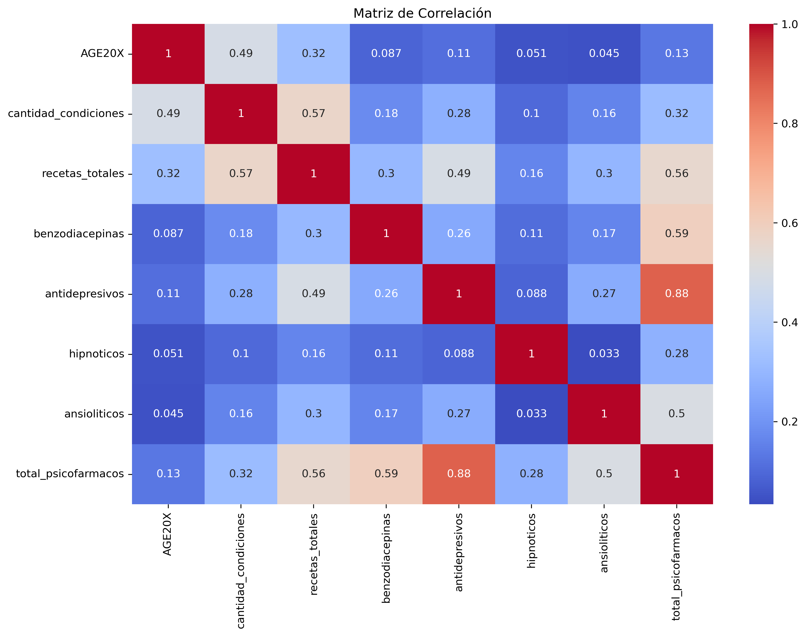
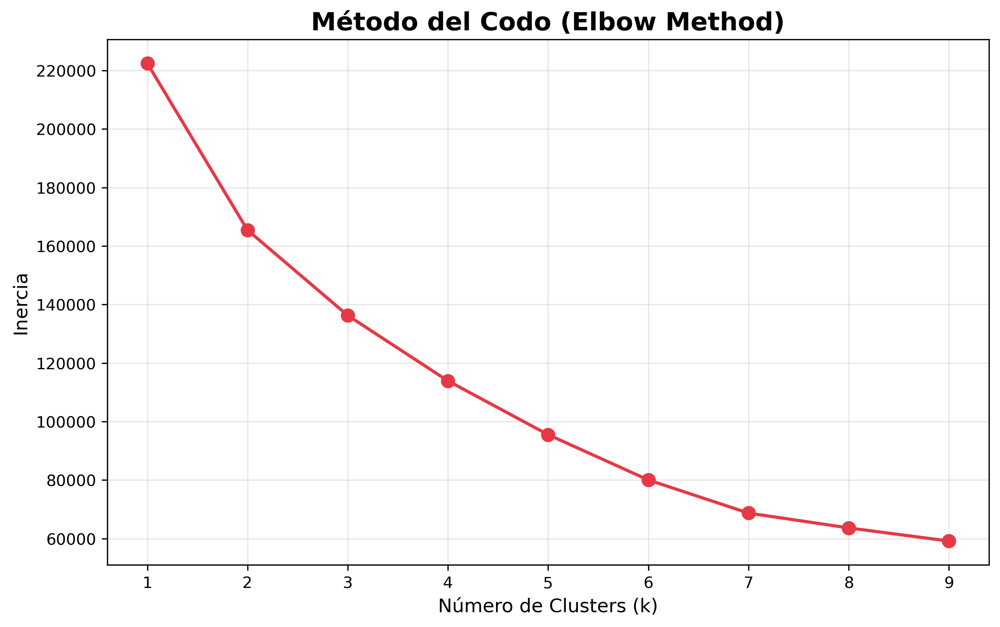
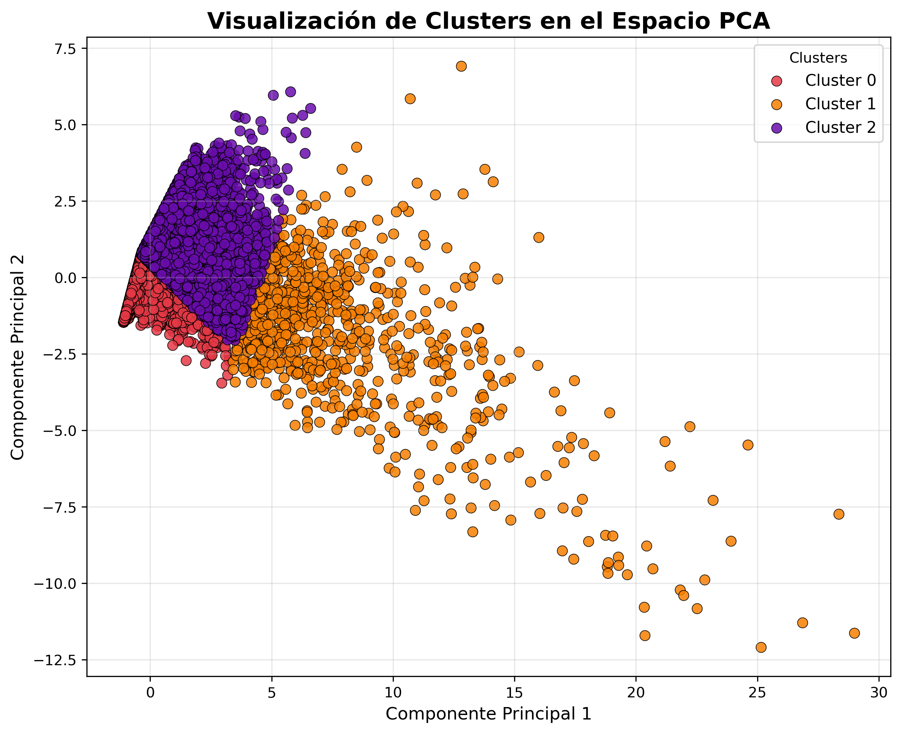

# Presentación del Modelo y Análisis de Resultados

## Segmentación mediante detección de patrones en población adulta en el consumo de psicofármacos con fines terapéuticos

## Alumna: Betiana Ruth Burgos
----------
# Índice

## 1. Introducción

## 2. Fundamentación del Problema

## 3. Objetivos

##   * 3.1 Objetivo General
##   * 3.2 Objetivos Específicos

## 4. Origen de los Datos

##   * 4.1 H224 – Full Year Consolidated Data File
##   * 4.2 H222 – Medical Conditions File
##   * 4.3 H229A – Prescribed Medicines File
##   * 4.4 Justificación de la Selección de los Datos

## 5. Construcción del Dataset Final

##   * 5.1 Selección de Variables
##   * 5.2 Construcción de Variables Derivadas
##   * 5.3 Integración de los Conjuntos de Datos
##   * 5.4 Limpieza y Preparación de los Datos
##  * 5.5 Dataset Final

## 6. Descripción Completa del Dataset

##   * 6.1 Características Generales
##   * 6.2 Diccionario de Variables
##   * 6.3 Clasificación de las Variables
##   * 6.4 Relevancia del Dataset para el Problema de Investigación

## 7. Análisis Exploratorio de Datos

##   * 7.1 Distribución de la Edad
##   * 7.2 Complejidad Clínica de la Población
##   * 7.3 Consumo de Psicofármacos
##   * 7.4 Relación entre Variables
##   * 7.5 Principales Hallazgos del Análisis Exploratorio

## 8. Preparación de los Datos para el Modelado

##   * 8.1 Selección de Variables
##   * 8.2 Estandarización de Variables
##   * 8.3 Reducción de Dimensionalidad mediante PCA

## 9. Modelo de Aprendizaje Automático

##   * 9.1 Tipo de Aprendizaje
##   * 9.2 Principal Component Analysis (PCA)
##   * 9.3 K-Means Clustering
##   * 9.4 Determinación del Número de Clusters

## 10. Resultados del Modelo

##    * 10.1 Visualización de los Clusters
##    * 10.2 Caracterización General de los Clusters
##    * 10.3 Interpretación de los Resultados

## 11. Evaluación del Modelo

##    * 11.1 Inercia
##    * 11.2 Silhouette Score
##    * 11.3 Evaluación General

## 12. Discusión

## 13. Conclusiones

## 14. Limitaciones y Trabajos Futuros

## 15. Bibliografía

------------

# 1. Introducción

La salud mental constituye actualmente uno de los principales desafíos para los sistemas sanitarios a nivel mundial. Durante las últimas décadas se ha registrado un incremento sostenido en la prevalencia de trastornos asociados a la ansiedad, la depresión, los trastornos del sueño y otras afecciones psicológicas que afectan significativamente la calidad de vida de las personas. Este fenómeno ha estado acompañado por un aumento en la utilización de medicamentos psicotrópicos destinados al tratamiento de dichas problemáticas, convirtiendo a los psicofármacos en uno de los grupos terapéuticos de mayor relevancia dentro de la práctica clínica contemporánea.

Los psicofármacos comprenden un amplio conjunto de medicamentos que actúan sobre el sistema nervioso central y que son utilizados para el tratamiento de diversas afecciones relacionadas con la salud mental. Entre ellos se encuentran los ansiolíticos, las benzodiacepinas, los hipnóticos y los antidepresivos, cuyo uso se ha expandido considerablemente en las últimas décadas. Si bien estos medicamentos cumplen un rol fundamental dentro de los tratamientos terapéuticos, su utilización no se distribuye de manera homogénea en la población, sino que se encuentra influenciada por múltiples factores demográficos, socioeconómicos y clínicos.

Comprender los patrones de consumo de psicofármacos representa un desafío complejo debido a la gran cantidad de variables involucradas. Factores como la edad, el sexo, el nivel educativo, la situación económica, el acceso a servicios de salud, la cobertura médica y la presencia de enfermedades crónicas pueden influir de manera significativa en la utilización de estos medicamentos. En consecuencia, resulta necesario emplear metodologías capaces de analizar simultáneamente múltiples dimensiones del fenómeno.

En este contexto, las técnicas de Aprendizaje Automático constituyen herramientas especialmente útiles para el análisis de grandes volúmenes de información sanitaria. Estas metodologías permiten identificar patrones, relaciones y estructuras ocultas dentro de los datos, aportando información valiosa para la comprensión de fenómenos complejos. Particularmente, las técnicas de aprendizaje no supervisado posibilitan detectar agrupamientos naturales entre individuos sin necesidad de contar con categorías previamente definidas.

El presente proyecto tiene como objetivo aplicar técnicas de Aprendizaje Automático no supervisado para identificar patrones de consumo de psicofármacos en población adulta. Para ello se construyó un dataset integrado a partir de diferentes conjuntos de datos pertenecientes a la encuesta Medical Expenditure Panel Survey (MEPS) correspondiente al año 2020. La integración de múltiples fuentes permitió combinar información demográfica, socioeconómica, clínica y farmacológica, generando una base de datos especialmente diseñada para abordar el problema de investigación planteado.

A través de la utilización de técnicas de reducción de dimensionalidad y algoritmos de clustering, se busca detectar perfiles diferenciados de individuos según sus características y patrones de consumo farmacológico. De esta manera, el trabajo pretende demostrar la utilidad del Aprendizaje Automático como herramienta para el análisis de fenómenos vinculados a la salud pública y contribuir a una mejor comprensión de los factores asociados al consumo de psicofármacos.

----------

# 2. Fundamentación del Problema

El consumo de psicofármacos constituye un fenómeno de creciente relevancia dentro de los sistemas de salud contemporáneos. La expansión de los diagnósticos relacionados con la salud mental, junto con una mayor disponibilidad de tratamientos farmacológicos, ha contribuido al incremento de la utilización de medicamentos destinados al tratamiento de trastornos psicológicos y psiquiátricos.

Sin embargo, el consumo de psicofármacos no puede entenderse únicamente como una consecuencia directa de la presencia de una determinada enfermedad. Diversas investigaciones han demostrado que existen múltiples factores que condicionan tanto el acceso a estos tratamientos como las modalidades de utilización de los medicamentos. Variables como la edad, el sexo, el nivel educativo, la situación económica, la cobertura sanitaria y la presencia de enfermedades concomitantes influyen significativamente en los patrones de consumo observados en la población.

Desde una perspectiva analítica, esta complejidad plantea importantes desafíos metodológicos. Los enfoques tradicionales basados exclusivamente en estadísticas descriptivas pueden resultar insuficientes para identificar relaciones complejas entre múltiples variables. Por esta razón, las técnicas de Ciencia de Datos y Aprendizaje Automático se han convertido en herramientas cada vez más utilizadas para el análisis de información sanitaria.

En particular, los algoritmos de clustering permiten identificar grupos de individuos que comparten características similares sin necesidad de contar con clasificaciones previamente definidas. Esta capacidad resulta especialmente útil para estudiar fenómenos complejos en los cuales las categorías no son evidentes a priori. En lugar de imponer una clasificación preestablecida, el algoritmo permite que sean los propios datos los que revelen la existencia de diferentes perfiles o segmentos poblacionales.

La aplicación de estas técnicas al estudio del consumo de psicofármacos permite explorar preguntas relevantes para la salud pública. Por ejemplo, resulta posible investigar si existen grupos diferenciados de individuos según sus niveles de consumo farmacológico, si determinadas características sociodemográficas se asocian a mayores niveles de utilización o si la complejidad clínica influye en la conformación de distintos perfiles de consumo.

En este contexto, el presente trabajo se propone responder la siguiente pregunta de investigación:

¿Es posible identificar perfiles diferenciados de consumo de psicofármacos en población adulta a partir de variables demográficas, socioeconómicas y clínicas mediante técnicas de Aprendizaje Automático no supervisado?

La hipótesis que orienta el proyecto sostiene que el consumo de psicofármacos no se distribuye de manera uniforme dentro de la población y que, mediante la aplicación de técnicas de clustering, es posible identificar grupos de individuos con patrones de consumo diferenciados.

Además de su relevancia temática, este trabajo posee un importante valor metodológico. La construcción de un dataset integrado, la generación de variables derivadas, la realización de análisis exploratorios y la implementación de modelos de Aprendizaje Automático constituyen etapas fundamentales dentro de cualquier proyecto de Ciencia de Datos. Por este motivo, el proyecto permite aplicar de manera práctica los contenidos desarrollados durante la asignatura y ejemplificar el potencial de estas herramientas para abordar problemáticas reales vinculadas al campo de la salud.

-----
# 3. Objetivos
Objetivo General

Identificar patrones de consumo de psicofármacos en población adulta mediante la aplicación de técnicas de Aprendizaje Automático no supervisado sobre un dataset integrado construido a partir de información sanitaria, demográfica y farmacológica.

Objetivos Específicos
Integrar múltiples conjuntos de datos provenientes de la encuesta MEPS.
Construir un dataset consolidado para el análisis del consumo de psicofármacos.
Caracterizar la población estudiada mediante técnicas de análisis exploratorio.
Analizar la relación entre variables sociodemográficas, clínicas y farmacológicas.
Aplicar técnicas de reducción de dimensionalidad mediante PCA.
Implementar algoritmos de clustering utilizando K-Means.
Identificar perfiles diferenciados de consumo de psicofármacos.
Interpretar los resultados obtenidos y evaluar su utilidad para comprender el fenómeno estudiado.

-------

# 4. Origen de los Datos

La calidad y pertinencia de los datos constituyen uno de los factores más importantes en cualquier proyecto de Aprendizaje Automático. En este trabajo se utilizaron datos provenientes de la Medical Expenditure Panel Survey (MEPS), una encuesta nacional desarrollada por la Agency for Healthcare Research and Quality (AHRQ) de los Estados Unidos. Esta encuesta es considerada una de las fuentes públicas más completas para el estudio de los gastos médicos, la utilización de servicios de salud, las condiciones clínicas y el consumo de medicamentos dentro de la población civil no institucionalizada.

MEPS recopila información detallada sobre miles de individuos y hogares estadounidenses mediante entrevistas periódicas realizadas a lo largo del año. Los datos obtenidos permiten analizar aspectos vinculados al estado de salud de las personas, el acceso a servicios sanitarios, la cobertura médica, las condiciones socioeconómicas y la utilización de medicamentos prescritos.

La elección de esta fuente se fundamenta en la amplitud y riqueza de la información disponible, así como en la posibilidad de relacionar variables pertenecientes a distintas dimensiones del fenómeno estudiado. Esto permite construir una visión integral del consumo de psicofármacos y analizar simultáneamente factores demográficos, económicos, clínicos y farmacológicos.

Para la construcción del dataset final se utilizaron tres conjuntos de datos correspondientes al año 2020.

## 4.1 H224 – Full Year Consolidated Data File

El archivo H224 constituye el conjunto principal de la encuesta MEPS. Contiene información consolidada de los participantes e incluye variables relacionadas con características demográficas, económicas, educativas y sanitarias.

A partir de este conjunto se seleccionaron variables consideradas relevantes para el estudio del consumo de psicofármacos:

AGE20X (edad)
SEX (sexo)
MARRY20X (estado civil)
EDUCYR (años de educación)
POVCAT20 (categoría de ingresos)
EMPST53 (situación laboral)
INSCOV20 (cobertura médica)
MNHLTH53 (estado de salud mental)
RTHLTH53 (estado general de salud)
RACETHX (grupo racial o étnico)

Estas variables permiten caracterizar el contexto social y sanitario de los individuos, proporcionando información fundamental para interpretar los patrones de consumo observados posteriormente.

## 4.2 H222 – Medical Conditions File

El archivo H222 contiene información sobre las condiciones médicas registradas para cada participante de la encuesta.

A diferencia del archivo consolidado, este conjunto posee múltiples registros por individuo, ya que cada fila representa una condición médica específica. Como consecuencia, una misma persona puede aparecer repetida varias veces dentro del archivo.

Con el objetivo de incorporar esta dimensión clínica al análisis, se realizó un proceso de agregación mediante el cual se contabilizó la cantidad total de condiciones médicas registradas para cada individuo.

Como resultado se generó la variable:

cantidad_condiciones

Esta variable constituye un indicador aproximado del nivel de complejidad clínica de cada participante y permite evaluar la relación existente entre el estado de salud general y el consumo de psicofármacos.

## 4.3 H229A – Prescribed Medicines File

El archivo H229A contiene información relacionada con medicamentos prescritos utilizados por los participantes de la encuesta.

Cada registro representa una receta individual y proporciona información sobre los medicamentos consumidos durante el período relevado.

Este conjunto resultó especialmente importante para el desarrollo del proyecto debido a que permitió identificar medicamentos pertenecientes a diferentes categorías de psicofármacos.

A partir de este archivo se construyeron las siguientes variables:

recetas_totales
benzodiacepinas
antidepresivos
hipnoticos
ansioliticos

Posteriormente se creó una variable adicional denominada:

total_psicofarmacos

obtenida mediante la suma de las distintas categorías farmacológicas consideradas en el estudio.

Esta variable resume el nivel general de consumo de psicofármacos y constituye uno de los principales indicadores utilizados durante el proceso de segmentación.

## 4.4 Justificación de la Selección de los Datos

La combinación de los archivos H224, H222 y H229A permitió integrar dimensiones complementarias del fenómeno estudiado.

Mientras que el archivo H224 aporta información demográfica y socioeconómica, el archivo H222 incorpora una dimensión clínica vinculada a la complejidad sanitaria de los individuos. Por su parte, el archivo H229A proporciona información directamente relacionada con el consumo de medicamentos.

La integración de estas tres fuentes permitió construir un dataset especialmente diseñado para responder la pregunta de investigación planteada, generando una base de datos capaz de representar múltiples aspectos asociados al consumo de psicofármacos.

-------

# 5. Construcción del Dataset Final

Una de las etapas más importantes del proyecto consistió en la construcción de un dataset integrado a partir de múltiples fuentes de información. Aunque los archivos utilizados pertenecen a la misma encuesta, cada uno presenta estructuras y niveles de granularidad diferentes. Por este motivo fue necesario desarrollar un proceso de preparación y unificación que permitiera generar una única base de datos apta para el análisis y modelado.

## 5.1 Selección de Variables

La primera etapa consistió en identificar aquellas variables que resultaban relevantes para el problema de investigación.

La selección se realizó considerando tanto antecedentes teóricos como la disponibilidad de información dentro de los conjuntos de datos utilizados.

Se priorizaron variables capaces de representar diferentes dimensiones asociadas al consumo de psicofármacos:

Variables demográficas
Edad
Sexo
Grupo racial o étnico
Variables socioeconómicas
Estado civil
Nivel educativo
Categoría de ingresos
Situación laboral
Variables sanitarias
Cobertura médica
Estado de salud general
Estado de salud mental
Variables clínicas
Cantidad de condiciones médicas
Variables farmacológicas
Cantidad total de recetas
Benzodiacepinas
Antidepresivos
Hipnóticos
Ansiolíticos
Total de psicofármacos

Esta selección permitió construir una representación multidimensional de la población estudiada.

## 5.2 Construcción de Variables Derivadas

No todas las variables utilizadas en el análisis se encontraban disponibles de manera directa en los archivos originales.

Por este motivo fue necesario construir nuevas variables a partir de procedimientos de agregación y transformación.

Cantidad de Condiciones Médicas

A partir del archivo H222 se contabilizó el número total de diagnósticos asociados a cada individuo.

Esta variable permite aproximar el grado de complejidad clínica y evaluar si las personas con mayor carga de enfermedad presentan patrones diferenciados de consumo farmacológico.

Cantidad Total de Recetas

Utilizando el archivo H229A se contabilizó el número total de recetas asociadas a cada participante.

Este indicador proporciona una medida general de utilización de medicamentos.

Clasificación de Psicofármacos

Posteriormente se identificaron medicamentos pertenecientes a diferentes categorías farmacológicas de interés:

Benzodiacepinas
Antidepresivos
Hipnóticos
Ansiolíticos

Una vez identificados, se contabilizó la cantidad consumida por cada individuo dentro de cada categoría.

Finalmente se calculó la variable:

total_psicofarmacos

mediante la suma de todos los grupos farmacológicos considerados.

## 5.3 Integración de los Conjuntos de Datos

La integración de los tres archivos se realizó utilizando la variable:

DUPERSID

Esta variable corresponde a un identificador único asignado a cada participante de la encuesta y permitió relacionar correctamente la información procedente de las distintas fuentes.

Se aplicaron operaciones de unión (merge) utilizando DUPERSID como clave primaria, consolidando toda la información relevante en una única fila por individuo.

Como resultado se obtuvo un dataset integrado que reúne información demográfica, socioeconómica, clínica y farmacológica.

## 5.4 Limpieza y Preparación de los Datos

Una vez realizada la integración, se llevaron a cabo diversas tareas de limpieza y preparación de datos:

Verificación de registros duplicados.
Revisión de consistencia entre variables.
Conversión de tipos de datos.
Tratamiento de valores faltantes.
Validación de variables derivadas.
Control de integridad de los registros.

Estas tareas permitieron mejorar la calidad de la información y garantizar la confiabilidad de los resultados obtenidos posteriormente.

## 5.5 Dataset Final

Como resultado del proceso de integración y preparación se obtuvo un dataset consolidado compuesto por aproximadamente 27.805 individuos y 18 variables, donde cada fila representa una persona identificada mediante la variable DUPERSID.

Este conjunto de datos constituye la base sobre la cual se desarrollaron las etapas posteriores de análisis exploratorio, reducción de dimensionalidad y modelado mediante técnicas de Aprendizaje Automático

-----

##  6. Descripción Completa del Dataset

## 6.1 Características Generales

El dataset final fue construido a partir de la integración de tres conjuntos de datos pertenecientes a la encuesta Medical Expenditure Panel Survey (MEPS) correspondiente al año 2020.

Como resultado del proceso de selección, transformación y unificación de datos se obtuvo una base consolidada especialmente diseñada para el análisis del consumo de psicofármacos en población adulta.

### Información General

| Característica | Descripción |
|---------------|-------------|
| Nombre del dataset | Dataset_Psicofarmacos_Final |
| Fuente | Medical Expenditure Panel Survey (MEPS) |
| Año | 2020 |
| Cantidad de registros | 27.805 |
| Cantidad de variables | 18 |
| Unidad de análisis | Individuo |
| Identificador único | DUPERSID |
| Tipo de dataset | Tabular |
| Formato final | CSV |

Cada fila representa una persona identificada mediante la variable DUPERSID.

## 6.2 Diccionario de Variables

| Variable | Descripción | Tipo de Dato | Tipo de Variable |
|-----------|-------------|-------------|------------------|
| DUPERSID | Identificador único del individuo | Object | Cualitativa Nominal |
| AGE20X | Edad del individuo | Int64 | Cuantitativa Discreta |
| SEX | Sexo | Int64 | Cualitativa Nominal |
| MARRY20X | Estado civil | Int64 | Cualitativa Nominal |
| EDUCYR | Años de educación completados | Int64 | Cuantitativa Discreta |
| POVCAT20 | Categoría de ingresos respecto al nivel de pobreza | Int64 | Cualitativa Ordinal |
| EMPST53 | Situación laboral | Int64 | Cualitativa Nominal |
| INSCOV20 | Cobertura médica | Int64 | Cualitativa Nominal |
| MNHLTH53 | Estado de salud mental autopercibido | Int64 | Cualitativa Ordinal |
| RTHLTH53 | Estado general de salud autopercibido | Int64 | Cualitativa Ordinal |
| RACETHX | Grupo racial o étnico | Int64 | Cualitativa Nominal |
| cantidad_condiciones | Número total de condiciones médicas registradas | Int64 | Cuantitativa Discreta |
| recetas_totales | Cantidad total de recetas registradas | Int64 | Cuantitativa Discreta |
| benzodiacepinas | Cantidad de benzodiacepinas consumidas | Int64 | Cuantitativa Discreta |
| antidepresivos | Cantidad de antidepresivos consumidos | Int64 | Cuantitativa Discreta |
| hipnoticos | Cantidad de hipnóticos consumidos | Int64 | Cuantitativa Discreta |
| ansioliticos | Cantidad de ansiolíticos consumidos | Int64 | Cuantitativa Discreta |
| total_psicofarmacos | Cantidad total de psicofármacos consumidos | Int64 | Cuantitativa Discreta |

## 6.3 Clasificación de las Variables

Con el objetivo de comprender la naturaleza de los datos utilizados en el análisis, las variables pueden clasificarse de la siguiente manera:

### Variables Demográficas

| Variable | Descripción |
|-----------|-------------|
| AGE20X | Edad |
| SEX | Sexo |
| RACETHX | Grupo racial o étnico |
| MARRY20X | Estado civil |

### Variables Socioeconómicas

| Variable | Descripción |
|-----------|-------------|
| EDUCYR | Nivel educativo |
| POVCAT20 | Categoría de ingresos |
| EMPST53 | Situación laboral |

### Variables Sanitarias

| Variable | Descripción |
|-----------|-------------|
| INSCOV20 | Cobertura médica |
| MNHLTH53 | Estado de salud mental |
| RTHLTH53 | Estado general de salud |

### Variables Clínicas

| Variable | Descripción |
|-----------|-------------|
| cantidad_condiciones | Cantidad de diagnósticos médicos registrados |

### Variables Farmacológicas

| Variable | Descripción |
|-----------|-------------|
| recetas_totales | Total de recetas registradas |
| benzodiacepinas | Consumo de benzodiacepinas |
| antidepresivos | Consumo de antidepresivos |
| hipnoticos | Consumo de hipnóticos |
| ansioliticos | Consumo de ansiolíticos |
| total_psicofarmacos | Total de psicofármacos consumidos |

## 6.4 Relevancia del Dataset para el Problema de Investigación

Una de las principales fortalezas del dataset construido es la integración de múltiples dimensiones del fenómeno estudiado.

A diferencia de bases de datos centradas exclusivamente en variables farmacológicas o clínicas, el conjunto desarrollado incorpora simultáneamente información demográfica, socioeconómica, sanitaria y farmacológica. Esto permite analizar el consumo de psicofármacos desde una perspectiva integral y explorar posibles relaciones entre las características de los individuos y sus patrones de utilización de medicamentos.

Asimismo, la construcción de variables derivadas como cantidad_condiciones y total_psicofarmacos permitió generar indicadores específicos para el problema de investigación, facilitando posteriormente la aplicación de técnicas de Aprendizaje Automático orientadas a la identificación de perfiles de consumo.

El dataset final constituye, por lo tanto, una base de datos especialmente diseñada para estudiar patrones de utilización de psicofármacos y representa el insumo principal para las etapas de análisis exploratorio, reducción de dimensionalidad y segmentación desarrolladas en este proyecto.

---
# 7. Análisis Exploratorio de Datos

El Análisis Exploratorio de Datos (EDA, por sus siglas en inglés) constituye una etapa fundamental dentro de cualquier proyecto de Ciencia de Datos. Su objetivo principal consiste en comprender la estructura de la información disponible, identificar patrones preliminares, detectar posibles anomalías y generar hipótesis que orienten las etapas posteriores del modelado.

En este proyecto, el análisis exploratorio permitió caracterizar la población estudiada, comprender la distribución de las variables seleccionadas y evaluar la existencia de relaciones relevantes entre los distintos indicadores asociados al consumo de psicofármacos.

## 7.1 Distribución de la Edad  

La edad constituye una de las variables demográficas más importantes dentro del análisis debido a que numerosos estudios han demostrado que la utilización de medicamentos psicotrópicos suele variar significativamente entre distintos grupos etarios.

La distribución observada evidencia una amplia representación de individuos adultos pertenecientes a diferentes rangos de edad, permitiendo analizar patrones de consumo en una población heterogénea.

**Figura 1. Distribución de edades de la población estudiada.**

La presencia de individuos pertenecientes a múltiples grupos etarios aporta diversidad al conjunto de datos y favorece la identificación de perfiles diferenciados durante el proceso de segmentación.

## 7.2 Complejidad Clínica de la Población

La variable cantidad_condiciones fue construida a partir del archivo Medical Conditions File y representa el número total de condiciones médicas registradas para cada individuo.

Esta variable resulta particularmente relevante debido a que permite aproximar el nivel de complejidad clínica de los participantes.

**Figura 2. Distribución de la cantidad de condiciones médicas.**

Los resultados muestran una importante variabilidad entre individuos. Mientras algunos participantes presentan pocas condiciones médicas registradas, otros acumulan múltiples diagnósticos.

Esta heterogeneidad sugiere la existencia de diferentes niveles de necesidad sanitaria dentro de la población estudiada.

## 7.3 Consumo de Psicofármacos

Uno de los objetivos centrales del proyecto consiste en analizar los patrones de utilización de medicamentos psicotrópicos.

Para ello se construyeron variables específicas asociadas al consumo de:

- Benzodiacepinas.
- Antidepresivos.
- Hipnóticos.
- Ansiolíticos.

**Figura 3. Distribución del consumo por categoría farmacológica.**

Los resultados muestran diferencias significativas entre las distintas categorías de medicamentos.

Estas diferencias evidencian que determinados grupos farmacológicos poseen una mayor presencia dentro de la población estudiada, reflejando posibles tendencias terapéuticas asociadas al tratamiento de problemas vinculados a la salud mental.

## 7.4 Relación entre Variables

Con el objetivo de identificar posibles asociaciones entre las variables numéricas seleccionadas se construyó una matriz de correlación.

**Figura 4. Matriz de correlación de variables numéricas.**

El análisis de correlación permitió observar asociaciones positivas entre:

- Cantidad de condiciones médicas.
- Cantidad de recetas.
- Total de psicofármacos consumidos.

Estos resultados sugieren que los individuos con mayor complejidad clínica tienden a registrar niveles más elevados de utilización de medicamentos.

Asimismo, se observa una relación esperable entre la cantidad total de psicofármacos y las distintas categorías farmacológicas consideradas.

## 7.5 Principales Hallazgos del Análisis Exploratorio

A partir del análisis realizado pueden destacarse los siguientes hallazgos:

- Existe una importante heterogeneidad dentro de la población estudiada.
- Se observan diferencias significativas en los niveles de consumo de psicofármacos.
- La complejidad clínica parece asociarse a una mayor utilización de medicamentos.
- Las variables seleccionadas presentan suficiente variabilidad para justificar la aplicación de técnicas de clustering.
- El conjunto de datos posee características adecuadas para la identificación de perfiles diferenciados de consumo.

En conjunto, estos resultados respaldan la continuidad del proceso analítico mediante técnicas de Aprendizaje Automático orientadas a la segmentación de individuos.

---

# 8. Preparación de los Datos para el Modelado

Antes de aplicar los algoritmos de Aprendizaje Automático fue necesario realizar una etapa de preparación de datos.

Esta fase tiene como objetivo garantizar que las variables utilizadas presenten condiciones adecuadas para el entrenamiento de los modelos y evitar que diferencias de escala afecten los resultados obtenidos.

## 8.1 Selección de Variables

Para el modelado se seleccionaron las variables con mayor relevancia para el análisis del consumo de psicofármacos:

- AGE20X
- cantidad_condiciones
- recetas_totales
- benzodiacepinas
- antidepresivos
- hipnoticos
- ansioliticos
- total_psicofarmacos

Estas variables representan aspectos demográficos, clínicos y farmacológicos considerados centrales para la construcción de perfiles de consumo.

## 8.2 Estandarización de Variables

Las variables utilizadas presentan escalas diferentes.

Por ejemplo, la edad puede tomar valores cercanos a 80 años, mientras que otras variables representan cantidades de medicamentos o condiciones médicas.

Para evitar que las variables con mayor magnitud dominen el proceso de agrupamiento, se aplicó un proceso de estandarización utilizando la técnica StandardScaler.

Este procedimiento transforma las variables de manera que todas posean media cero y desviación estándar igual a uno.

La estandarización constituye una práctica habitual en algoritmos basados en distancias, como K-Means.

## 8.3 Reducción de Dimensionalidad mediante PCA

Una vez estandarizados los datos se aplicó Principal Component Analysis (PCA).

PCA es una técnica de reducción de dimensionalidad que permite transformar un conjunto de variables correlacionadas en un número menor de componentes principales.

El objetivo principal consiste en conservar la mayor cantidad posible de información reduciendo simultáneamente la complejidad del conjunto de datos.

La utilización de PCA permitió:

- Simplificar la estructura de los datos.
- Reducir redundancias.
- Facilitar la visualización de los resultados.
- Mejorar la interpretación de los clusters obtenidos.

---

# 9. Modelo de Aprendizaje Automático

## 9.1 Tipo de Aprendizaje

El problema abordado corresponde al campo del Aprendizaje No Supervisado.

A diferencia de los problemas de clasificación, no existen etiquetas previas que indiquen a qué grupo pertenece cada individuo.

Por este motivo se emplearon algoritmos capaces de descubrir patrones y estructuras presentes en los datos sin necesidad de contar con categorías previamente definidas.

## 9.2 Principal Component Analysis (PCA)

La primera técnica utilizada fue PCA.

Esta metodología permitió reducir la dimensionalidad del conjunto de datos conservando gran parte de la variabilidad original.

La representación obtenida mediante los componentes principales facilitó posteriormente la visualización de los grupos identificados por el algoritmo de clustering.

## 9.3 K-Means Clustering

El algoritmo principal utilizado para la segmentación fue K-Means.

K-Means busca dividir los datos en K grupos minimizando la distancia entre los individuos pertenecientes a un mismo cluster y maximizando la separación respecto de los demás grupos.

La elección de este algoritmo se fundamenta en:

- Su simplicidad.
- Su eficiencia computacional.
- Su amplia utilización en problemas de segmentación.
- Su facilidad de interpretación.

## 9.4 Determinación del Número de Clusters

Para determinar la cantidad óptima de grupos se aplicó el Método del Codo.

**Figura 5. Método del Codo para selección de K.**

El análisis permitió identificar un punto de inflexión a partir del cual la reducción de la inercia comienza a estabilizarse.

Este criterio fue utilizado para seleccionar el número final de clusters.

---
# 10. Resultados del Modelo

La aplicación conjunta de PCA y K-Means permitió identificar grupos diferenciados dentro de la población analizada. Estos grupos representan conjuntos de individuos que comparten características similares en términos de edad, complejidad clínica y consumo de psicofármacos.

La segmentación obtenida evidencia que el consumo de psicofármacos no constituye un fenómeno homogéneo, sino que presenta patrones diferenciados dentro de la población estudiada.

## 10.1 Visualización de los Clusters

La representación gráfica de los datos utilizando los dos primeros componentes principales permitió observar la distribución espacial de los individuos y la conformación de los distintos clusters.

**Figura 6. Representación de clusters mediante PCA.**

La visualización muestra que los grupos identificados presentan cierto grado de separación, indicando que existen diferencias reales entre los perfiles detectados por el algoritmo.

Aunque algunos sectores presentan superposición parcial, los resultados sugieren la existencia de estructuras subyacentes dentro de los datos que justifican la utilización de técnicas de segmentación.

## 10.2 Caracterización General de los Clusters

El análisis descriptivo de los grupos obtenidos permitió identificar perfiles con características diferenciadas.

### Cluster 0: Bajo consumo farmacológico

Este grupo se caracteriza por presentar:

- Menor cantidad de recetas.
- Menor consumo de psicofármacos.
- Menor cantidad de condiciones médicas.
- Menor complejidad clínica general.

Los individuos pertenecientes a este cluster representan un perfil asociado a una utilización reducida de medicamentos y a una menor carga de enfermedad.

### Cluster 1: Consumo moderado

Los individuos agrupados en este cluster presentan características intermedias respecto al resto de los grupos.

Se observa:

- Consumo moderado de psicofármacos.
- Cantidad intermedia de condiciones médicas.
- Mayor heterogeneidad interna.

Este perfil podría representar individuos con necesidades terapéuticas específicas, pero sin alcanzar los niveles más elevados de complejidad clínica.

### Cluster 2: Alto consumo farmacológico

Este grupo concentra a los individuos con mayores niveles de utilización de medicamentos.

Sus principales características incluyen:

- Mayor cantidad de recetas.
- Mayor consumo total de psicofármacos.
- Mayor presencia de condiciones médicas.
- Elevada complejidad clínica.

Este perfil sugiere una mayor interacción con el sistema sanitario y una utilización más intensiva de tratamientos farmacológicos.

## 10.3 Interpretación de los Resultados

La segmentación obtenida permite sostener que existen diferencias significativas entre los individuos analizados.

Los resultados muestran que la complejidad clínica y el consumo farmacológico tienden a agruparse conjuntamente, sugiriendo una relación entre el estado de salud general y la utilización de psicofármacos.

Asimismo, la existencia de grupos claramente diferenciados respalda la hipótesis inicial del proyecto, según la cual el consumo de estos medicamentos no se distribuye de manera uniforme dentro de la población.

---

# 11. Evaluación del Modelo

La evaluación de modelos de aprendizaje no supervisado presenta características diferentes a las utilizadas en problemas de clasificación.

Debido a que no existen etiquetas reales contra las cuales comparar los resultados obtenidos, métricas como Accuracy, Precision, Recall o F1-Score no resultan apropiadas para este tipo de problema.

Por este motivo se utilizaron métricas específicas para clustering.

---

## 11.1 Inercia

La inercia representa la suma de las distancias cuadráticas entre los individuos y el centroide de su cluster correspondiente.

Valores más bajos indican una mayor cohesión interna dentro de los grupos obtenidos.

Durante el proceso de selección del número óptimo de clusters se analizó la evolución de esta métrica mediante el Método del Codo.

Los resultados mostraron una disminución progresiva de la inercia a medida que aumentaba el número de clusters, permitiendo identificar un punto de equilibrio entre complejidad y capacidad explicativa.

## 11.2 Silhouette Score

El índice de Silhouette constituye una de las métricas más utilizadas para evaluar algoritmos de clustering.

Esta medida considera simultáneamente:

- La cohesión interna de cada grupo.
- La separación existente entre clusters.

Valores cercanos a 1 indican grupos bien definidos, mientras que valores próximos a 0 sugieren superposición entre clusters.

El valor obtenido indica que la segmentación generada por el modelo resulta razonablemente consistente y permite diferenciar perfiles con características particulares.

## 11.3 Evaluación General

Considerando conjuntamente los resultados del Método del Codo, la Inercia y el Silhouette Score, puede afirmarse que el modelo logró identificar agrupamientos significativos dentro de los datos.

Si bien ningún algoritmo de clustering produce una segmentación perfecta, los resultados obtenidos presentan suficiente consistencia para ser interpretados desde una perspectiva analítica.

---

# 12. Discusión
Los resultados obtenidos en este proyecto permiten reflexionar sobre la complejidad del consumo de psicofármacos y sobre las ventajas que ofrecen las técnicas de Aprendizaje Automático no supervisado para analizar grandes volúmenes de datos sanitarios.

Uno de los hallazgos más relevantes fue la identificación de tres perfiles diferenciados de consumo mediante el algoritmo K-Means. Esta segmentación demuestra que la utilización de psicofármacos no sigue un patrón homogéneo en la población adulta, sino que responde a combinaciones específicas de factores demográficos y clínicos. Algunos clusters mostraron mayor consumo asociado a edades avanzadas y alta carga de condiciones médicas, mientras que otros presentaron consumos más bajos, lo que resalta la heterogeneidad del fenómeno.

El análisis exploratorio de datos reveló correlaciones importantes entre variables como cantidad_condiciones, recetas_totales y total_psicofarmacos. Estas relaciones sugieren que la multimorbilidad actúa como un fuerte predictor del consumo de psicofármacos. Además, la inclusión de variables demográficas (AGE20X, SEX, POVCAT20, EDUCYR, RACETHX) y socioeconómicas permitió enriquecer el análisis, mostrando que factores como la edad, el nivel educativo y la situación de pobreza también influyen en los patrones observados.

Metodológicamente, la aplicación combinada de Análisis de Componentes Principales (PCA) y K-Means resultó altamente efectiva. El PCA permitió reducir la dimensionalidad de los datos de forma significativa, reteniendo la mayor parte de la varianza original en solo dos componentes principales. Esto facilitó la visualización de la estructura subyacente de los datos y preparó el conjunto para la etapa de clustering. Posteriormente, K-Means logró agrupar a los 27.805 individuos en tres clusters homogéneos, revelando patrones que difícilmente habrían sido detectados mediante análisis estadísticos tradicionales.

La integración de información proveniente de los archivos H224 (Consolidated Data File), H222 (Medical Conditions File) y H229A (Prescribed Medicines File) de la encuesta MEPS constituyó un paso fundamental. Esta integración permitió construir un dataset robusto que combinó variables demográficas, clínicas y farmacológicas, lo que representa uno de los principales aportes técnicos del proyecto.

-----

# 13. Conclusiones
El presente proyecto tuvo como objetivo principal identificar patrones de consumo de psicofármacos en población adulta mediante técnicas de Aprendizaje Automático no supervisado.

Para alcanzar este objetivo se construyó un dataset integrado con 27.805 registros y 18 variables, combinando información demográfica (AGE20X, SEX, POVCAT20, EDUCYR, RACETHX), clínica (cantidad_condiciones) y farmacológica (recetas_totales, benzodiacepinas, antidepresivos, hipnoticos, ansioliticos y total_psicofarmacos), proveniente de los archivos H224, H222 y H229A de la encuesta MEPS.

El análisis exploratorio permitió observar una importante heterogeneidad en la población estudiada y establecer relaciones relevantes entre las variables. Mediante la técnica de Análisis de Componentes Principales (PCA) se redujo exitosamente la dimensionalidad del conjunto de datos, preservando una proporción significativa de la varianza original en dos componentes principales. Esta reducción facilitó la visualización de los datos y preparó el terreno para la aplicación del algoritmo de clustering.

Posteriormente, la implementación de K-Means con 3 clusters permitió segmentar a los individuos en grupos homogéneos según su perfil de edad, carga de morbilidad y consumo de psicofármacos. Los clusters obtenidos mostraron perfiles claramente diferenciados, confirmando que el consumo de estos medicamentos responde a patrones específicos y no aleatorios.

Los resultados respaldan plenamente la hipótesis inicial del proyecto y demuestran el potencial de las técnicas de Aprendizaje Automático no supervisado (especialmente la combinación de PCA y K-Means) para descubrir estructuras ocultas en datos de salud. Este trabajo no solo aporta conocimiento sobre el consumo de psicofármacos, sino que también evidencia cómo estas técnicas pueden convertirse en herramientas útiles para apoyar la toma de decisiones en salud pública.

Desde el punto de vista formativo, el proyecto permitió aplicar de manera práctica y completa las etapas clave del Aprendizaje Automático: preprocesamiento de datos, reducción de dimensionalidad, modelado no supervisado, evaluación de resultados e interpretación de los clusters.

---------

# 14. Limitaciones y Trabajos Futuros
Aunque los resultados son prometedores, es importante reconocer las limitaciones del estudio. En primer lugar, los datos utilizados provienen de la encuesta MEPS, por lo que los hallazgos están condicionados por las variables disponibles y por posibles sesgos inherentes a las encuestas de autoinforme. En segundo lugar, la clasificación de los psicofármacos en las distintas categorías farmacológicas implicó decisiones metodológicas subjetivas que podrían perfeccionarse.

Además, el algoritmo K-Means, si bien adecuado para una primera aproximación, presenta limitaciones conocidas (como la necesidad de definir previamente el número de clusters y su sensibilidad a la inicialización).

## Trabajos futuros recomendados:

* Explorar otros algoritmos de clustering no supervisado, tales como DBSCAN, Agglomerative Clustering, Gaussian Mixture Models y Spectral Clustering, para comparar su desempeño con K-Means.

* Incorporar nuevas variables relevantes, como diagnósticos específicos de trastornos mentales, duración de los tratamientos farmacológicos, utilización de psicoterapia o calidad de vida percibida.

* Desarrollar modelos de Aprendizaje Automático supervisado (Regresión Logística, Random Forest, Gradient Boosting, Redes Neuronales) para predecir la probabilidad de alto consumo de psicofármacos.

* Realizar análisis longitudinales utilizando diferentes paneles de la encuesta MEPS, con el fin de estudiar la evolución temporal de los patrones de consumo.
Evaluar la posibilidad de integrar datos de otras fuentes (registros administrativos o encuestas de salud mental) para enriquecer el modelo.

-------

# 15. Bibliografía

- Revision de clases grabadas, "Aprendizaje Automatico, año 2026" ( Campus Politecnico Malvinas)
- Material Bibliografico (Libro 1 y Libro 2, Aprendizaje Automatico , alo 2026, Campus Politecnico Malvinas)
- Agency for Healthcare Research and Quality (AHRQ). Medical Expenditure Panel Survey (MEPS).
- Hastie, T., Tibshirani, R. y Friedman, J. (2009). The Elements of Statistical Learning.
- Géron, A. (2022). Hands-On Machine Learning with Scikit-Learn, Keras and TensorFlow.
- Pedregosa, F. et al. Scikit-Learn: Machine Learning in Python.
- McKinney, W. Python for Data Analysis.
- Documentación oficial de Pandas.
- Documentación oficial de NumPy.
- Documentación oficial de Scikit-Learn.
- Grok (IA, para resolver conflictos con los codigos)
- DaVinci( creacion de imagenes)
- Canva ( video)
- ChatGPT( mejorar diseño de imagenes)

